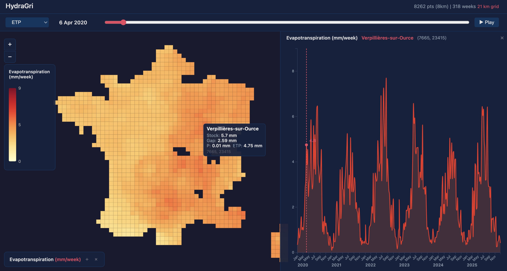
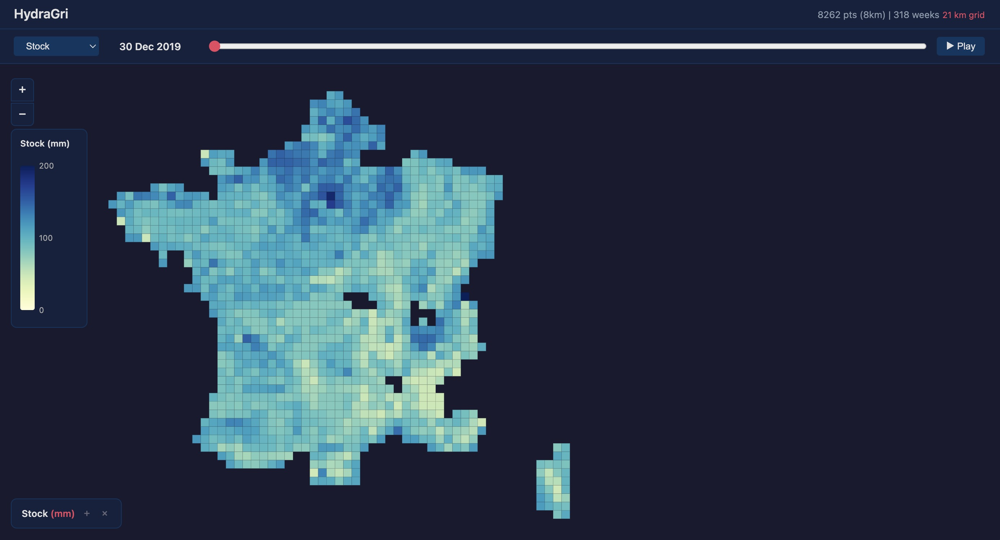
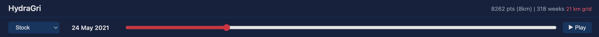

# HydraGri

Interactive visualization of agricultural water balance (hydric gap) across France, from 2020 to 2025.

Built with D3.js, using meteorological, agricultural, and soil data to simulate daily water stock and deficit at ~8,000 SAFRAN grid points, then aggregated at multiple spatial scales for smooth map exploration.



---

## Sources

| Source | Description | Data used |
|--------|------------|-----------|
| **SAFRAN / SIM** (Météo-France) | Meteorological reanalysis on an 8 km grid over France | Daily precipitation (`P = PRELIQ + PRENEI`) and reference evapotranspiration (`ETP`), 2020-2025 |
| **Agreste 2020** (Ministère de l'Agriculture) | Communal agricultural census | Crop distribution (cereals, prairies, permanent cultures, vineyards), SAU (agricultural area), irrigation percentage per commune |
| **RPG 2023** (IGN) | Registre Parcellaire Graphique – georeferenced agricultural parcels | Parcel coordinates (Lambert II), commune codes, soil type identifiers |
| **BDGSF** (INRAE) | Base de Données Géographiques des Sols de France – soil map | Soil water reserve capacity (`RU`) classified in 7 levels (50–200 mm) via a shapefile |
| **geo.api.gouv.fr** | French administrative geographic codes | Commune, département and région codes and names (`https://geo.api.gouv.fr/`) |

---

## Process

### Theory

The core model is a **daily soil water balance** for each SAFRAN grid point:

```
Stock(j) = Stock(j-1) + P(j) - ETP(j) × Kc
```

- `Stock` is the available water in the soil (mm), capped at `RU_max` (soil reserve capacity).
- `P` is the daily precipitation.
- `ETP` is the reference evapotranspiration.
- `Kc` is the **crop coefficient**, a weighted average based on the local crop mix:
  - Cereals: 1.15, Prairies: 0.95, Permanent cultures: 0.95, Vineyards: 0.70
- When `Stock` drops below 0, the deficit is recorded as `Gap` (the hydric gap, i.e. theoretical irrigation need) and `Stock` resets to 0.
- Stock resets to `RU_max` at the start of each year (soil assumed fully recharged after winter).

### Pipeline

The processing chain is split into sequential scripts. Each reads the output of the previous one.

```
preprocess.py → link_commune_safran.py → process_gap_with_kc.py → aggregate.py → export_json.py
```

**Step 1 – Preprocessing** (`scripts/preprocess.py`)
- Filters and reduces raw SIM data (keeps `LAMBX`, `LAMBY`, `DATE`, `ETP`, `PRE`).
- Reduces RPG columns to the needed subset.
- Aggregates administrative codes from `geo.api.gouv.fr` into a single `geo-code.json`.

**Step 2 – Link communes to SAFRAN grid** (`scripts/link_commune_safran.py`)
- Converts SAFRAN coordinates from Lambert II étendu (hectometers) to WGS84 using `pyproj`.
- For each SAFRAN point, finds all communes within a 10 km radius (KDTree).
- Computes a weighted average `Kc` and irrigation percentage based on each commune's crop distribution and SAU.
- Output: `data/agreste/safran_commune_kc.csv`

**Step 3 – Water balance calculation** (`scripts/process_gap_with_kc.py`)
- Loads Kc data and SIM daily data (2020-2025).
- Performs a spatial join with the BDGSF shapefile to assign `RU_max` per point.
- Runs the daily water balance loop for every SAFRAN point, streaming results to disk.
- Output: `data/gap_results_with_kc.csv` (~18 M rows)

**Step 4 – Temporal & spatial aggregation** (`scripts/aggregate.py`)
- **Temporal**: aggregates daily data to weekly averages (mean P, ETP, Stock, Gap per point per week).
- **Spatial**: creates 7 grid levels by binning points into coarser cells and averaging values:

| Level | Grid size | Points |
|-------|-----------|--------|
| 0 | 8 km | ~8,262 |
| 1 | 11 km | ~4,471 |
| 2 | 15 km | ~2,445 |
| 3 | 21 km | ~1,310 |
| 4 | 29 km | ~718 |
| 5 | 41 km | ~385 |
| 6 | 64 km | ~176 |

- Outputs: `data/gap_results_with_kc_weekly.csv` + `data/spatial_scales/*.csv`

**Step 5 – JSON export** (`scripts/export_json.py`)
- Converts each spatial scale CSV to a compact JSON file (columnar layout: arrays of x, y, weeks, metrics).
- Associates each grid cell to the nearest commune name.
- Outputs: `data/level_*_weekly.json` (7 files loaded by the visualization).

### Reproducing the pipeline

```bash
# Prerequisites: Python 3.11+, virtual environment
python -m venv .venv && source .venv/bin/activate
pip install pandas numpy geopandas scipy pyproj shapely tqdm

# Place raw data files (see Sources) in data/

# Run each step in order
python scripts/preprocess.py
python scripts/link_commune_safran.py
python scripts/process_gap_with_kc.py
python scripts/aggregate.py both data/gap_results_with_kc.csv data/
python scripts/export_json.py
```

---

## Visualization

Single-page D3.js application (`viz.html`) — no build step, just a static file served over HTTP.

```bash
python3 -m http.server 8000
# open http://localhost:8000/viz.html
```

### Features

- **Multi-scale map**: automatically switches between the 7 grid levels as you zoom in/out (minimum 10 px per cell).
- **4 indicators** selectable via dropdown: Stock, Gap, Precipitation, Evapotranspiration — each with its own color scale.
- **Time slider**: scrub through 318 weeks (2020-W00 → 2025-W52) or press Play to animate.
- **Tooltip on hover**: shows all 4 values for the pointed cell.
- **Time series panel**: click a cell to open a full time series chart on the right (area + line), with a marker on the current week.
- **Indicator description**: collapsible panel explaining the selected indicator.

### Screenshots

**Home — Stock indicator at full extent**



**Complete view — ETP map + time series for a selected cell**


**Time slider header**



**All spatial scales (matplotlib debug view)**


**Indicator explanation panel**


